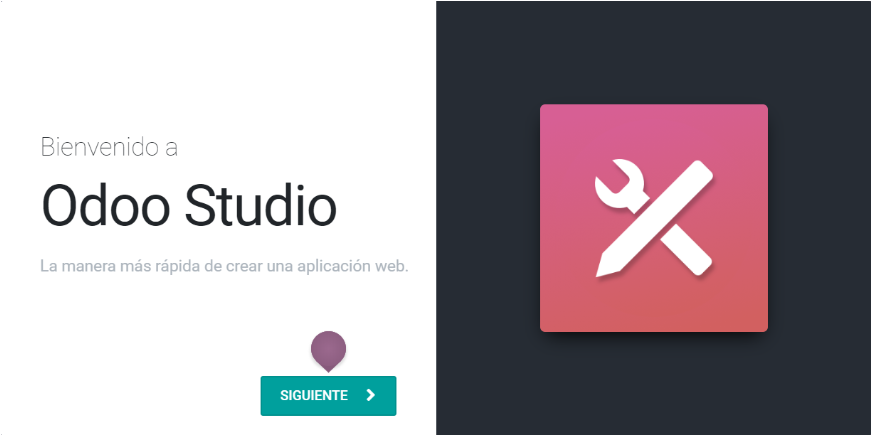

# Documentación Odoo
*************************************************************
## Taller Studio

1 
https://www.odoo.com/es_ES/

Comienza ahora\
Selecciona Accounting, Purchase, Inventory, Web, CRM,  y Studio.\
Continuar\

Agregar el prefijo training- (training-dataintelligence-001) en el nombre de la empresa para tener 10 meses de prueba.\

************************************************************
Crear APP\
Odoo Studio, NEXT, materialdi001, NEXT

Crear el nombre del modelo: di Request,
  CREATE YOUR APP y tenemos el CRUD sobre nuestra primera tabla listo!

2 Crear menús asociados a modelos.
Edit Menu permite asociar modelos a nuestra aplicación y establecerles jerarquias.

3 Agregar campos a formularios

4 Configurar la plataforma de entrenamiento.

*************************************************************
## Taller de creación de una DB en Odoo

1 Creación del módulo DataintAPP

2 El modelo lógico de la BdeD a implementar

3 El manifiesto

4 Modelos

5 Las relaciones entre los modelos\
5.1 Many2one\
5.2 One2many

6 Creacion de menus y ventanas

7 Seguridad
*************************************************************
## Formulario

C:\Users\usuario>cd ../..

cd "Program Files (x86)"\
cd "Odoo 13.0"\
cd server

Para levantar el servicio:\
C:\Program Files (x86)\Odoo 13.0\server>"C:\Program Files (x86)\Odoo 13.0\python\python.exe" odoo-bin -c odoo.conf

ImportError: DLL load failed: %1 no es una aplicación Win32 válida.\
Hay que borrar el python de: C:\Users\usuario\AppData\Roaming\python

Para construir un módulo:\
C:\Program Files (x86)\Odoo 13.0\server>"C:\Program Files (x86)\Odoo 13.0\python\python.exe" odoo-bin scaffold mi_segundo_proyecto "D:\addons"

*************************************************************
## RSS

Para consumir contenido RSS y darle formato HTML automático:\
https://rss.app/feed/JmFbsIWEWgNQ0AkA/embed\

https://surfing-waves.com/feed.htm\

*************************************************************
Calculadora online huella de carbono
https://www.carbonfootprint.com/integrate.html

## Curso Studio

I Conceptos generales\
https://www.odoo.com/documentation/user/13.0/es/studio/concepts/understanding_general.html

II Acciones automatizadas Introduccion\
https://www.odoo.com/documentation/user/13.0/es/studio/concepts/understanding_automated_actions.html

III Creando Modelos y anadiendo Campos\
https://www.odoo.com/documentation/user/13.0/es/studio/use_cases/models_fields.html

IV Filtros y barra de status\
https://www.odoo.com/documentation/user/13.0/es/studio/use_cases/filters_status_bar.html

V Acciones automaticas \
https://www.odoo.com/documentation/user/13.0/es/studio/use_cases/automated_actions.html

VI Vistas\
https://www.odoo.com/documentation/user/13.0/es/studio/use_cases/views.html

VII Personalizando el hombre del arcoiris\
https://www.odoo.com/documentation/user/13.0/es/studio/how_to/rainbow_man.html

VIII Reportes personalizados\
https://www.odoo.com/documentation/user/13.0/es/studio/how_to/reports.html

XI Exportando e importando modulos\
https://www.odoo.com/documentation/user/13.0/es/studio/how_to/export_import.html

