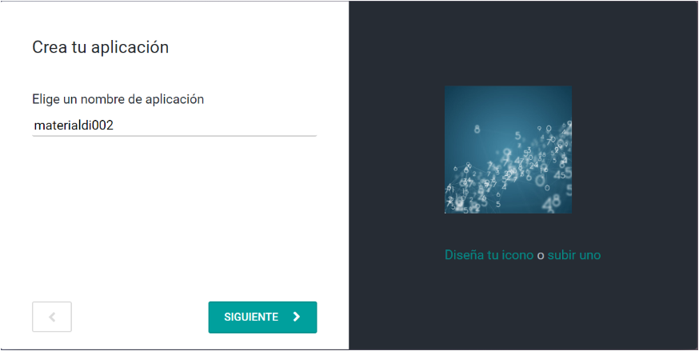
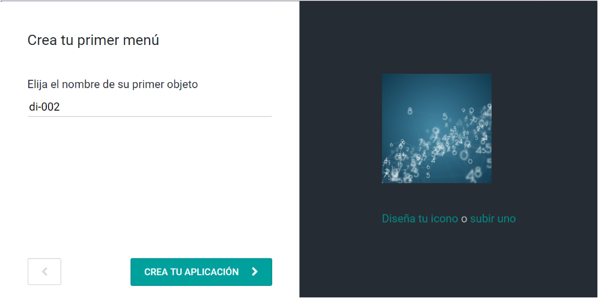
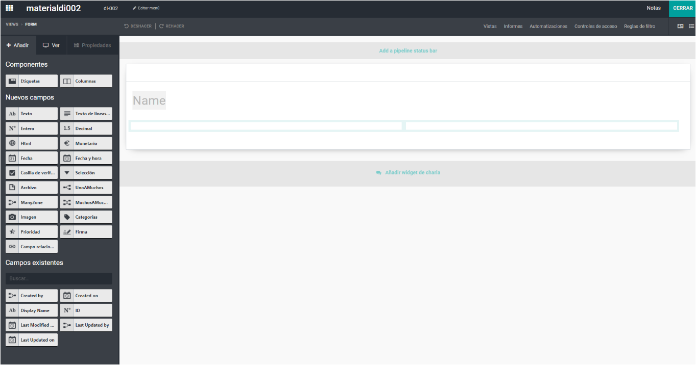

# Documentación Odoo
Modo desarrollador por URL

<strong>web?debug=1</strong> 

*************************************************************
## Taller Studio I 
************************************************************
************************************************************
### 1 Construyendo nuestra primera App y Modelo.
Obtén una base de datos Odoo para practicar\
https://www.odoo.com/es_ES/
Comienza ahora\
Selecciona Accounting, Purchase, Inventory, Web, CRM,  y Studio.\
Configurar

Agregamos el prefijo training- (training-dataintelligence-001) en el nombre de la empresa para tener 10 meses de prueba.

Ingresamos directamente a Studio

Creamos nuestra aplicación\
Dá click a New App

Construimos el modelo

Llegamos al espacio de trabajo Studio. Salimos.

Podemos hacer nuestro primer CRUD.
************************************************************
### 2 Menús y Modelos múltiples.
En di Request damos click a Studio y en
Edit Menu, que con New Menu permite asociar modelos a nuestra aplicación y establecerles jerarquias.
Introduce un nombre y selecciona un modelo: Pedido de compra, dale a CONFIRMAR.
Creamos una jerarquía creando un nuevo elemento de menu sin asociarlo a modelo alguno y agrupándolo.

************************************************************
### 3 Agregar campos a formularios
Vamos a General Views\
Forms\
Jugamos con columnas y tabs.\
Agregamos un texto llamado Note.

Seleccionamos Views, Múltiple Records Views, List.\
Agregamos Note, Created by y Created on.

************************************************************

### 4 Configurar la plataforma de entrenamiento.

Configuremos multiples unidades de medida y agreguemos productos a Inventario.\
Vamos al inicio.\
Damos click a App Inventory\
Master data, Products, Create\
Un subrayado grueso en odoo implica campo mandatory

Creamos un nuevo producto: datos001 y Guardamos.\
Vamos a Inventory Products.\
Vamos a Inventory, Configuration, Settings, Products, y seleccionamos Units of measure.\

Ahora en Inventory aparece UdM Categories y UdM, asi que en Unit of Measure Categories puedes crear una nueva unidad de medida: Categoria: Area y salvar.\

% Vamos a UoM, Filters, Category contains Unit, \
% en UoM, Filters, Category contains Area, APPLY

paciencia

Creamos una nueva unidad de medida\
Unit of measure: m2\
Category: Area\
Save.

Vamos a UdM Unit of measure cambiela a Piece
*************************************************************
Vamos a Master Data Products.\
Importaremos una hoja excel\
Import\
Load the file

Code: Internal reference\
Product Name: Name\
Type: Product type\
UdM: Unit of Measure\ Sirve activo.
IMPORTAR

4.2 Instalar la aplicación de trabajadores y crear departamentos de la companía

4.3 Establecer multiples Warehouses y crear una nueva Warehouse

************************************************************

### 5 Construir formularios y grillas.
************************************************************
5.1 Many2one\
Vamos al modelo , Studio  y llevamos una relacion Many2one , se nos pedirá a que modelo asociar. Damos click a HD department y cambiamos su label.
Retornemos al modelo y podremos generar registros con un campo de departamento.\
Vamos a la View y agregamos Department.

5.2 Automatizacion

Queremos generar un campo autoincremental automatizado en id Request.\
Vamos a di Request, borremos todos los registros, que son Departamentos.\
Vamos a Studio y le sacamos al label principal el ticket en required y lo hacemos read only.\
Damos click en Automations, CREATE.

action name:        id Request\
Trigger Condition:  On Creation\
Action to Do:       Execute code Python

Vamos al modo desarrollador\
Technical\
Sequences\
CREATE

Name:           di SEQ.\
Sequence Code:  material.request.seq

Prefix: di/%(year)s\
Sequence Size 5\
Step  1\
Next Number 1\
SAVE

Volvamos a di Request, Studio, Automations, y ejecutamos el código python:\
record['x_name']=env['ir.sequence'].next_by_code('material.request.seq')\
x_name es el nombre técnico de nuestro registro de di Request.\
Creamos un nuevo registro debe generarse el autoincremental.\
Buscamos secuencias con Ajustes, Technical, Sequences y aparecerá material.request.seq\
En Views podemos cambiar el orden de las columnas.

5.3 Create by y Created on\

Vamos a la vista crear de nuestro modelo y le damos click a studio.\
Agregamos un campo Selection y le asignamos dos valores: borrador y confirmado y CONFIRM, le damos el label de Status y lo hacemos Read only y Default value, Draft.\
Anadimos los campos Created by y Created on y cerramos Studio.\
Vamos a la vista del modelo y anadimos las columnas Status,  Created on y Created by, cerramos la vista.

5.4 Grillas para modelos

Creemos un Modelo para los registros de la grilla llamado basesdi\
Vamos a new di Request\
Vamos a Studio y Creamos un Nuevo Menu\
*Name : basesdi\
*Model : basesdi\
CONFIRM, CONFIRM

Traemos a un registro de nuestro modelo una Many2one, Relation basesdi.\
Traemos a un registro de nuestro modelo una Related Field, Unit of measure, Unit of measure, CONFIRM.\
Le cambiamos la label a UoM\
Deberia cargar perfecto.

Hagamos Name Invisible

Agregamos un Text Note y un Decimal Number Qty.

que falta? hay que ingresar basesdi a di Request.\
Agreguemos en Views de di Request, basesdi, Qty., UoM y removemos Name.

En di Request no podemos agregar una relacion One2many, pues se debe tener una Many2one en basesdi en relacion con di Request. Ahora lo podemos hacer y tenemos la grilla funcionando perfecto. Puedo editarla dando click sobre ella.

Cometimos un error. Hacer invisible el booleano.

5.5 Modificaciones

************************************************************

### 6 Botones y Acciones de Servidor.
************************************************************
6.1 Crear botones\
6.2 Acciones de servidor\
6.3 Primera accion de servidor\
6.4 Ocultar el boton de confirmacion

*************************************************************
## Taller de creación de una DB en Odoo I
************************************************************
************************************************************

1 Creación del módulo DataintAPP

2 El modelo lógico de la BdeD a implementar

3 El manifiesto

4 Modelos

5 Las relaciones entre los modelos\
5.1 Many2one\
5.2 One2many

6 Creacion de menus y ventanas

7 Seguridad
*************************************************************
## Formulario

C:\Users\usuario>cd ../..

cd "Program Files (x86)"\
cd "Odoo 13.0"\
cd server

Para levantar el servicio:\
C:\Program Files (x86)\Odoo 13.0\server>"C:\Program Files (x86)\Odoo 13.0\python\python.exe" odoo-bin -c odoo.conf

ImportError: DLL load failed: %1 no es una aplicación Win32 válida.\
Hay que borrar el python de: C:\Users\usuario\AppData\Roaming\python

Para construir un módulo:\
C:\Program Files (x86)\Odoo 13.0\server>"C:\Program Files (x86)\Odoo 13.0\python\python.exe" odoo-bin scaffold mi_segundo_proyecto "D:\addons"

*************************************************************
## RSS

Para consumir contenido RSS y darle formato HTML automático:\
https://rss.app/feed/JmFbsIWEWgNQ0AkA/embed\

https://surfing-waves.com/feed.htm\

*************************************************************
Calculadora online huella de carbono
https://www.carbonfootprint.com/integrate.html

## Curso Studio

I Conceptos generales\
https://www.odoo.com/documentation/user/13.0/es/studio/concepts/understanding_general.html

II Acciones automatizadas Introduccion\
https://www.odoo.com/documentation/user/13.0/es/studio/concepts/understanding_automated_actions.html

III Creando Modelos y anadiendo Campos\
https://www.odoo.com/documentation/user/13.0/es/studio/use_cases/models_fields.html

IV Filtros y barra de status\
https://www.odoo.com/documentation/user/13.0/es/studio/use_cases/filters_status_bar.html

V Acciones automaticas \
https://www.odoo.com/documentation/user/13.0/es/studio/use_cases/automated_actions.html

VI Vistas\
https://www.odoo.com/documentation/user/13.0/es/studio/use_cases/views.html

VII Personalizando el hombre del arcoiris\
https://www.odoo.com/documentation/user/13.0/es/studio/how_to/rainbow_man.html

VIII Reportes personalizados\
https://www.odoo.com/documentation/user/13.0/es/studio/how_to/reports.html

XI Exportando e importando modulos\
https://www.odoo.com/documentation/user/13.0/es/studio/how_to/export_import.html

